# ARRC-Fixed-Wing

## 1.0 Introduction  
The following is a collection of various 3D and 2D models and drawings I have made. 

## Samples:

### MM Series
<table>
  <tr>
    <td colspan="2" align="center">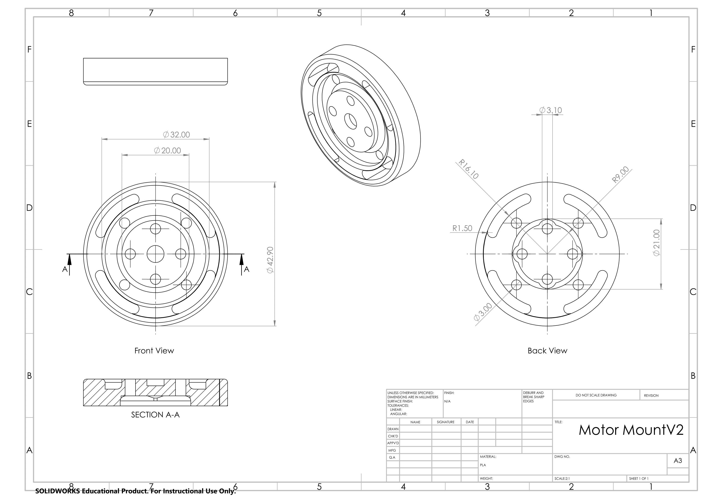</td>
  </tr>
  <tr>
    <td>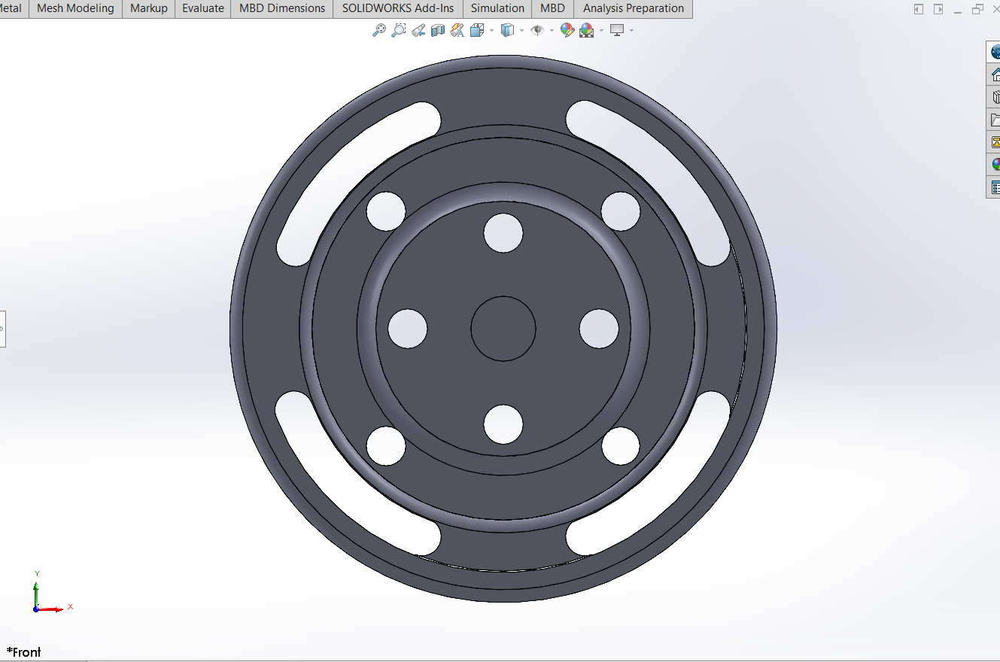</td>
    <td>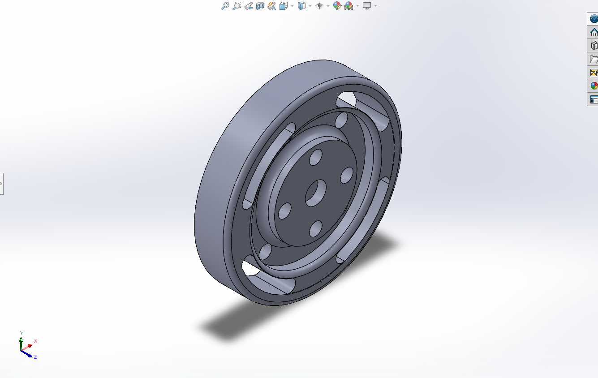</td>
  </tr>
</table>

### P Series
<table>
  <tr>
    <td>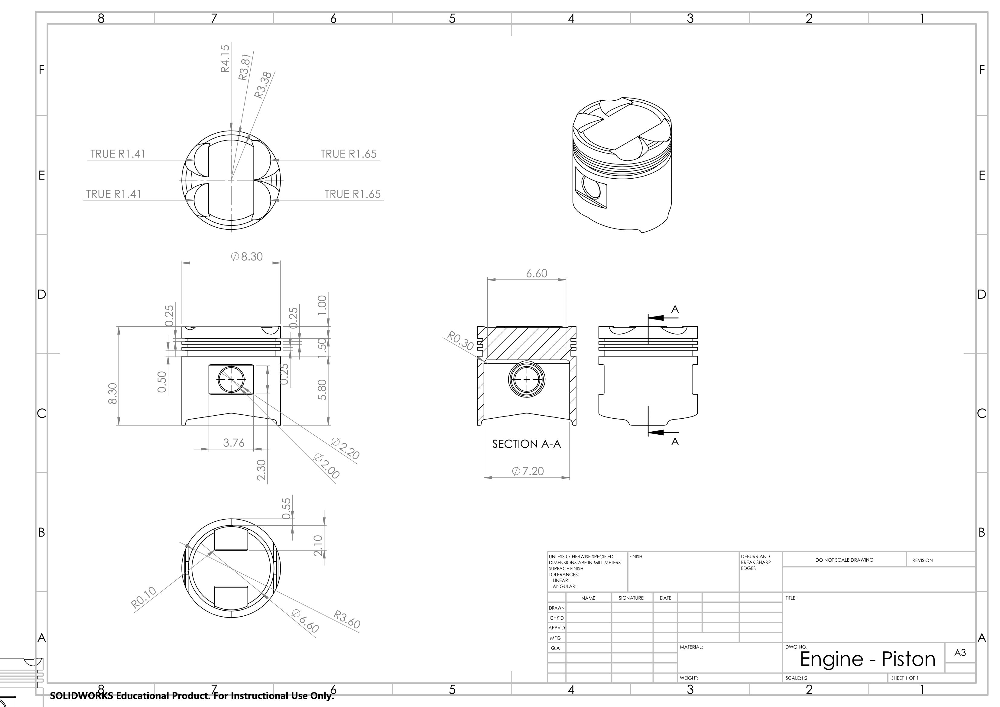</td>
    <td>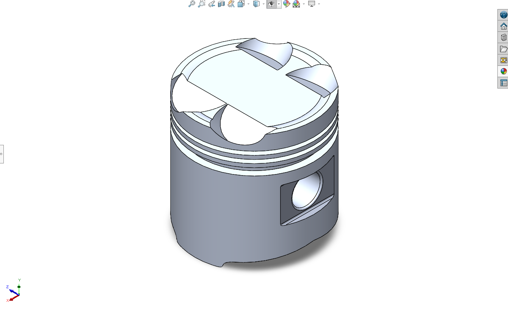</td>
  </tr>
</table>

### TF Series
<table>
  <tr>
    <td>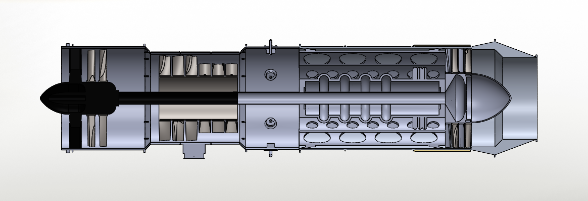</td>
    <td>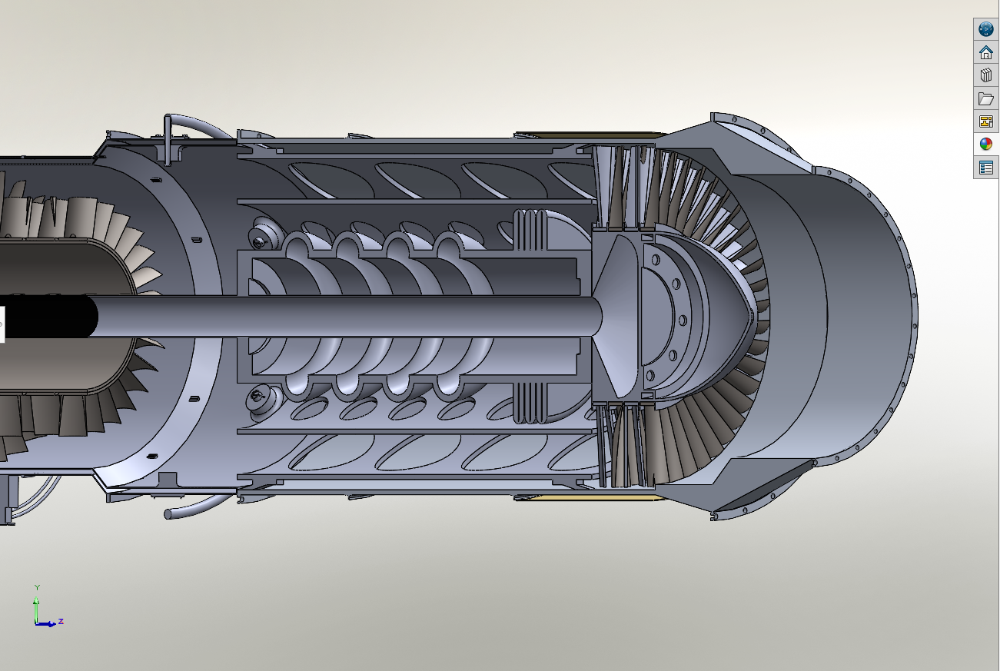</td>
  </tr>
  <tr>
    <td>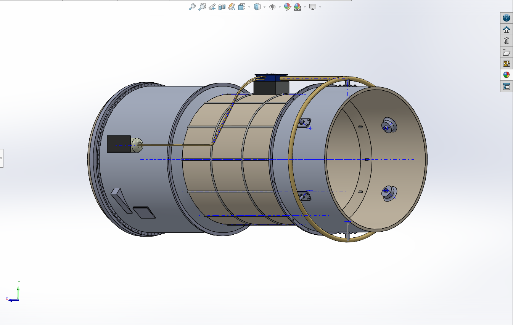</td>
    <td>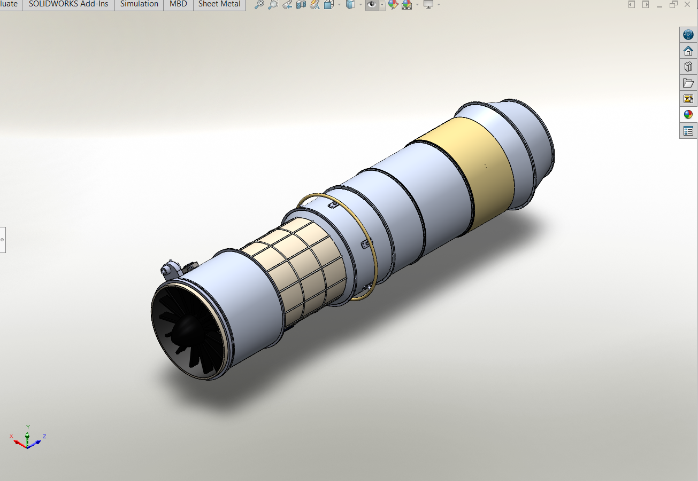</td>
  </tr>
  <tr>
    <td>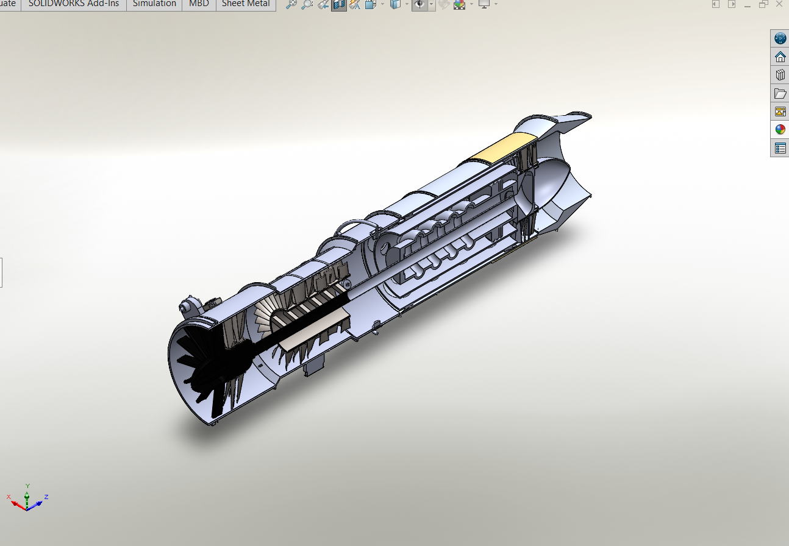</td>
    <td>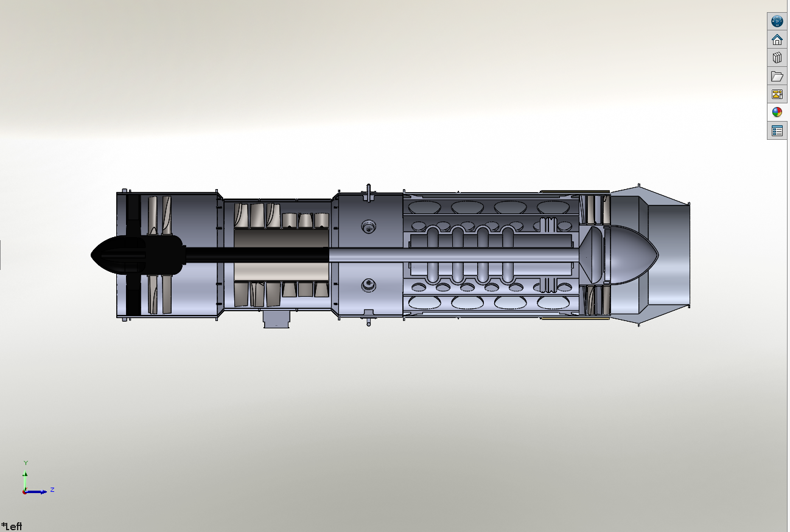</td>
  </tr>
</table>
